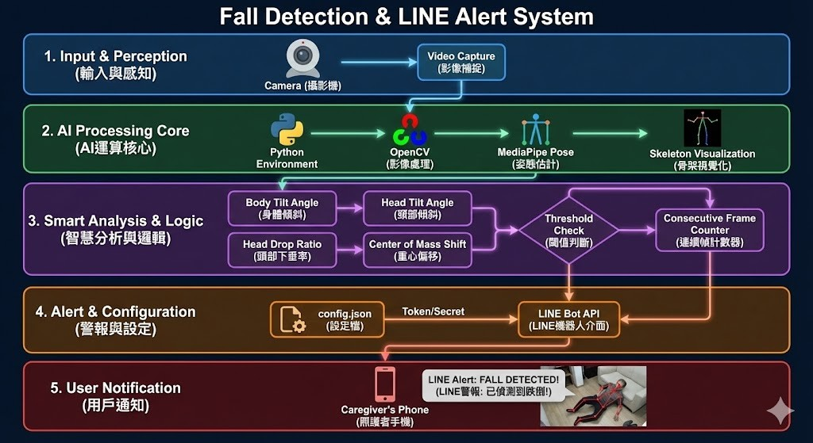

# 樂齡防傾倒 LINE Bot 通知系統

利用地端攝影機擷取畫面，進行骨架辨識（pose estimation），計算身體傾斜度，若超標則自動發送 LINE Bot 警示訊息。

---

## 系統架構圖



---

## 教學簡報

> **製作人：** 曾楚庭 | **指導老師：** 曾慶良

### [👉 點我開啟教學簡報](https://chatgpt3a01.github.io/elderly-fall-detection/slides/index.html)

| 簡報 | 說明 |
|------|------|
| [首頁總覽](https://chatgpt3a01.github.io/elderly-fall-detection/slides/index.html) | 課程總覽與功能特色 |
| [Part 1 - 專案介紹](https://chatgpt3a01.github.io/elderly-fall-detection/slides/Part1_專案介紹.html) | 專案背景與系統目標 |
| [Part 2 - 系統架構](https://chatgpt3a01.github.io/elderly-fall-detection/slides/Part2_系統架構.html) | 架構設計與技術解析 |
| [Part 3 - 環境安裝](https://chatgpt3a01.github.io/elderly-fall-detection/slides/Part3_環境安裝.html) | Python 環境與套件安裝 |
| [Part 4 - LINE Bot 設定](https://chatgpt3a01.github.io/elderly-fall-detection/slides/Part4_LINE_Bot設定.html) | LINE Developer 設定教學 |
| [Part 5 - 執行操作](https://chatgpt3a01.github.io/elderly-fall-detection/slides/Part5_執行操作.html) | 系統執行與操作指南 |

---

## 系統架構

```
elderly_fall_detection/
├── app.py                     # 主程式
├── config.json                # 設定檔
├── requirements.txt           # Python 套件需求
├── pose_detection/            # 姿勢偵測模組
│   ├── __init__.py
│   ├── detector.py            # 骨架偵測器（MediaPipe Pose）
│   ├── fall_detector.py       # 跌倒偵測邏輯
│   └── utils/
│       ├── __init__.py
│       └── angle_calc.py      # 角度計算公式
├── line_bot/                  # LINE Bot 模組
│   ├── __init__.py
│   ├── bot.py                 # Python 版本
│   ├── bot.js                 # Node.js 版本
│   └── package.json
└── screenshots/               # 警報截圖目錄
```

## 環境需求

- Python 3.8+
- 攝影機（內建或外接 USB）
- Windows / macOS / Linux

## 安裝步驟

### 1. 建立虛擬環境（建議）

```bash
# Windows
python -m venv venv
venv\Scripts\activate

# macOS / Linux
python3 -m venv venv
source venv/bin/activate
```

### 2. 安裝 Python 套件

```bash
pip install -r requirements.txt
```

需要的套件：
- `opencv-python` - 影像處理
- `mediapipe` - 骨架辨識
- `numpy` - 數值運算
- `line-bot-sdk` - LINE Bot SDK
- `requests` - HTTP 請求
- `Pillow` - 圖片處理

### 3. 設定 LINE Bot

#### 3.1 建立 LINE Bot

1. 前往 [LINE Developers Console](https://developers.line.biz/console/)
2. 建立 Provider（若無）
3. 建立 Messaging API Channel
4. 取得以下資訊：
   - **Channel Access Token**（在 Messaging API 頁籤）
   - **Channel Secret**（在 Basic settings 頁籤）

#### 3.2 取得 User ID

1. 在 LINE Developers Console 的 Messaging API 頁籤
2. 掃描 QR Code 加入你的 Bot 為好友
3. 使用以下方式取得 User ID：
   - 設定 Webhook 接收訊息
   - 或使用 LINE Official Account Manager

#### 3.3 設定 API 金鑰（二擇一）

**方法一：使用 .env 檔案（推薦）**

```bash
# 複製範本檔案
copy .env.example .env

# 編輯 .env 填入您的 LINE API 金鑰
```

**方法二：編輯 config.json**

```json
{
    "line_bot": {
        "channel_access_token": "你的 Channel Access Token",
        "channel_secret": "你的 Channel Secret",
        "user_id": "你的 User ID"
    },
    "detection": {
        "torso_angle_threshold": 35,
        "head_drop_threshold": 100,
        "center_shift_threshold": 150,
        "consecutive_frames_threshold": 5,
        "cooldown_seconds": 30
    },
    "camera": {
        "device_id": 0,
        "width": 640,
        "height": 480,
        "fps": 30
    },
    "notification": {
        "include_screenshot": true
    }
}
```

## 執行系統

### 基本執行

```bash
python app.py
```

### 指定設定檔

```bash
python app.py --config /path/to/config.json
```

### 指定攝影機

```bash
python app.py --camera 1
```

## 操作說明

執行後會開啟攝影機視窗，顯示即時骨架偵測結果。

### 快捷鍵

| 按鍵 | 功能 |
|------|------|
| `q` 或 `ESC` | 退出程式 |
| `c` | 校準（站立時按下） |
| `r` | 重置警報冷卻時間 |
| `s` | 手動截圖 |

## 偵測邏輯說明

### 傾斜角度計算公式

軀幹傾斜角度計算：

```python
# 向量法計算傾斜角度
# point1: 肩膀中點
# point2: 髖部中點
dx = point2[0] - point1[0]
dy = point2[1] - point1[1]
angle_rad = math.atan2(abs(dx), abs(dy))
angle_deg = math.degrees(angle_rad)
```

- **0°**: 完全垂直（正常站立）
- **35°**: 輕微傾斜（警告）
- **50°+**: 嚴重傾斜（緊急）

### 異常偵測條件（任一成立即觸發）

1. **軀幹線段角度 > 閾值**（預設 35°）
2. **頭部高度突然下降**
3. **身體中心點大幅偏移**（預設 150 像素）

### 防誤判機制

- **連續幀確認**: 需連續 5 幀偵測到異常才觸發
- **多指標交叉驗證**: 至少 2 個條件成立才觸發
- **冷卻時間**: 觸發後 30 秒內不重複觸發

## LINE Bot 通知格式

### 文字訊息

```
🆘 跌倒偵測警報 🆘

偵測到可能跌倒，請立即查看！

⏰ 時間：2024-01-01 12:00:00
📊 危險程度：🚨 嚴重
📐 軀幹傾斜角度：55.0°

請盡快確認長者安全狀況！
```

### Flex Message（卡片樣式）

系統會優先發送美觀的 Flex Message 卡片，包含：
- 紅色/黃色標題（依嚴重程度）
- 時間戳記
- 嚴重程度
- 傾斜角度

## 設定參數說明

### detection（偵測設定）

| 參數 | 說明 | 預設值 |
|------|------|--------|
| `torso_angle_threshold` | 軀幹傾斜角度閾值（度） | 35 |
| `head_drop_threshold` | 頭部下降閾值（像素） | 100 |
| `center_shift_threshold` | 中心位移閾值（像素） | 150 |
| `consecutive_frames_threshold` | 連續幀數閾值 | 5 |
| `cooldown_seconds` | 警報冷卻時間（秒） | 30 |

### camera（攝影機設定）

| 參數 | 說明 | 預設值 |
|------|------|--------|
| `device_id` | 攝影機 ID（0 為預設） | 0 |
| `width` | 畫面寬度 | 640 |
| `height` | 畫面高度 | 480 |
| `fps` | 目標幀率 | 30 |

## Node.js 版本（僅 LINE Bot）

如果只需要 LINE Bot 通知功能，可以使用 Node.js 版本：

```bash
cd line_bot
node bot.js
```

## 常見問題

### Q: 攝影機無法開啟？

1. 確認攝影機已正確連接
2. 嘗試其他 device_id（如 1, 2）
3. 確認沒有其他程式佔用攝影機

### Q: 無法發送 LINE 通知？

1. 確認 Channel Access Token 正確
2. 確認 User ID 正確
3. 確認已將 Bot 加為好友
4. 檢查網路連線

### Q: 誤報太多？

調整設定檔中的閾值：
- 增加 `torso_angle_threshold`（如 40°）
- 增加 `consecutive_frames_threshold`（如 10）
- 增加 `cooldown_seconds`（如 60）

### Q: 漏報太多？

調整設定檔中的閾值：
- 降低 `torso_angle_threshold`（如 30°）
- 降低 `consecutive_frames_threshold`（如 3）

## 技術細節

### 使用的技術

- **MediaPipe Pose**: Google 開源的即時人體姿勢估計
- **OpenCV**: 影像擷取與處理
- **LINE Messaging API**: 推播通知

### 偵測的關鍵點

- 頭部：鼻子
- 肩膀：左右肩膀
- 手臂：肘部、手腕
- 軀幹：肩膀中點 ↔ 髖部中點
- 腿部：膝蓋、腳踝

### 效能

- 目標 FPS：10+ FPS
- 實測效能：依硬體而異，一般可達 15-30 FPS

## 授權

MIT License
